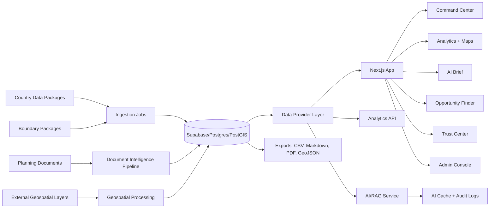

# PRD: Local Development Tracker Expansion

**Product:** Local Development Tracker (LDT)
**App URL:** https://wb-ldt-app.vercel.app/
**Document status:** Expanded PRD for Codex implementation
**Prepared:** 2026-06-22
**Primary implementation posture:** Evidence-first, PIM-ready decision support; not an official project approval, appraisal, budgeting, procurement, or asset-management system.

---

## 1. Executive Summary

The Local Development Tracker should evolve from a public analytics dashboard into a **country-configurable local investment intelligence layer**. The expanded product should help World Bank / MDB teams, ministries of finance, ministries of planning, line ministries, and local-government counterparts move from subnational diagnostics to explainable, plan-aligned public investment options.

The product should retain the current strengths of LDT: country workspaces, PIL scoring, maps, score drivers, source metadata, planning-document inventory, staged AI workflow, Supabase/PostGIS-backed data, MapLibre maps, Plotly charts, and public-facing transparency. The next build should add a structured layer that connects local development gaps to investment opportunity families, PIM concept-note starters, geospatial prioritization, climate-risk screening, document intelligence, AI auditability, and repeatable country onboarding.

The central product thesis is:

> LDT should become a **PIM-ready evidence-to-investment platform** that helps teams identify local development gaps, connect those gaps to local and national plans, screen them against climate and spatial risks, generate auditable upstream investment options, and prepare pre-appraisal concept-note inputs for formal government PIM processes.

This PRD intentionally avoids turning LDT into an automated project-selection engine. The app should support planning conversations and early-stage PIM preparation, but it should not produce final investment approvals, final project rankings, cost-benefit analyses, procurement decisions, budget allocations, or asset-management decisions unless those official government workflows and data sources are explicitly integrated later.

---

## 2. Strategic Product Positioning

### 2.1 What LDT should become

LDT should become a reusable platform with four layers:

1. **Local development evidence layer**: scores, indicators, maps, sources, release notes, data quality, and limitations.
2. **Planning-document intelligence layer**: local plans, national plans, sector strategies, document readiness, chunk retrieval, translation status, validation status, and plan themes.
3. **Investment intelligence layer**: investment opportunity families, evidence graphs, concept-note starters, climate/hazard screens, prioritization scenarios, and pre-appraisal readiness.
4. **Governance and delivery layer**: country onboarding factory, trust center, admin observability, AI audit logs, source lineage, role-based controls, future PIM/procurement/field-monitoring integrations.

### 2.2 What LDT should not become in this cycle

LDT should not claim to be:

- A formal PIM approval system.
- A substitute for feasibility studies or engineering design.
- A cost-benefit analysis engine.
- A budget-allocation system.
- A procurement system.
- A full asset registry.
- A platform for fully automated public investment decisions.
- A black-box AI recommender.

The product should present AI-assisted outputs as **diagnostic support, planning support, and pre-appraisal support**.

---

## 3. Evidence Base and Source Anchors

This expanded PRD incorporates the uploaded PRD, live LDT pages, and the deep research findings on public governance, GovTech, geospatial data, open contracting, climate-risk tools, GEMS-style monitoring, and generative AI governance.

### 3.1 Internal product evidence

The uploaded PRD defines LDT as a country-configurable decision-support platform for local development analytics, planning evidence, and public investment recommendations. It already lists the current app capabilities: country workspaces, score comparison, maps, score drivers, AI planning stages, and local strategy inventory. It also establishes an evidence-first principle: AI should synthesize rather than replace source data.

The live app home currently frames LDT as a tool for public investment decisions and for comparing local development conditions, reading score drivers, and linking planning evidence to public investment choices. The live methodology page explains the PIL framework, geospatial and tabular inputs, municipality-level aggregation, Supabase-backed historical data model, and current limitations. The live About page emphasizes a public, inspectable analytics surface rather than a closed score dashboard.

### 3.2 External research anchors

Use these sources as design references rather than as direct dependencies:

| Reference | Why it matters for LDT |
| --- | --- |
| World Bank GovTech Maturity Index 2025 | Supports the importance of core government systems, service delivery, citizen engagement, interoperability, and GovTech enablers. |
| OECD Digital Government Outlook 2026 | Supports emphasis on shared digital public infrastructure, data governance, implementation capability, and monitoring. |
| ThinkHazard | Reference for lightweight first-pass hazard screening by project area. |
| WRI Aqueduct | Reference for open, peer-reviewed water-risk and flood-risk data layers. |
| World Bank GEMS | Reference for low-cost geotagged field monitoring, digital data collection, and remote supervision. |
| OC4IDS / OCDS / CoST IDS | Reference for future project-to-contract transparency and infrastructure data interoperability. |
| NIST AI RMF Generative AI Profile | Reference for governance, content provenance, pre-deployment testing, incident disclosure, citation verification, and AI risk management. |
| EU AI Act | Reference for transparency, human oversight, logging, documentation, risk assessment, and robustness principles. |

---

## 4. Background

### 4.1 Current LDT context

LDT compares local development conditions across subnational governments using the PIL lens:

- **Prosperity**
- **Infrastructure**
- **Livability**

The current app supports public exploration through maps, scatterplots, score-driver charts, source metadata, release notes, and planning evidence. It uses a modern web stack, including Next.js, Supabase, Vercel, Plotly, and MapLibre.

The app has already moved beyond a single-country prototype. It now needs stronger product boundaries, repeatable onboarding, clearer release metadata, more robust trust indicators, a better AI report experience, and a bridge from diagnostics to PIM-ready investment opportunity development.

### 4.2 Known product-data consistency issue

The uploaded PRD and live app pages do not always present identical country and local-unit counts. This should not be treated as a content-editing issue only. It is a product requirement: LDT needs a **single release metadata source of truth** so the home page, country pages, methodology, release notes, analytics pages, exports, AI outputs, and admin views all reflect the same release state.

### 4.3 Why now

The next version is needed because:

- Country teams need to move from local diagnostics to investment conversations.
- Public investment specialists need explainable, plan-aligned investment options.
- Government counterparts need simple maps, caveats, and downloadable outputs.
- Data teams need repeatable country onboarding and document-readiness workflows.
- AI outputs need explicit citations, source lineage, prompt/version logging, and human review.
- Climate and geospatial screening should happen early in the investment lifecycle.
- Future integrations with PIM, budget, procurement, asset, and field-monitoring systems require a stronger underlying project/opportunity data model.

---

## 5. Objective

### 5.1 Primary objective

Make LDT a trusted **evidence-to-investment platform** that helps analysts and decision makers move from local development data to plan-aligned, climate-aware, spatially targeted public investment options.

### 5.2 Product goals

LDT should:

- Reduce time spent finding local evidence.
- Make score drivers easier to explain.
- Make planning-document readiness visible.
- Produce AI-assisted briefs grounded in clear evidence.
- Convert diagnostic gaps into explainable investment opportunity families.
- Generate PIM concept-note starter packs without pretending to complete formal appraisal.
- Screen opportunities against basic hazard, climate, and spatial layers.
- Make new country onboarding faster and less risky.
- Support government workshops with clear, exportable, evidence-backed materials.
- Preserve public-sector trust through source lineage, audit logs, and human review.

### 5.3 Strategic fit

LDT supports WBG/MDB advisory work on local development, GovTech, public investment management, climate-informed planning, and subnational governance. It should strengthen—not replace—core PIM decision-making processes.

---

## 6. Key Results

| Key Result | Target |
| --- | --- |
| KR1: Faster country onboarding | Add a new country workspace from prepared data and documents in less than 2 weeks of engineering time. |
| KR2: Better planning brief completion | At least 70% of AI-ready local units can generate a complete brief with score evidence, plan alignment, SWOT, and recommendations. |
| KR3: Clearer evidence trust | 100% of AI recommendations include source links, input status, evidence gaps, and caveats. |
| KR4: Better user comprehension | In usability testing, 80% of target users can explain a selected local unit's score drivers and plan-readiness status without help. |
| KR5: Better frontend performance | Analytics pages show useful content in under 3 seconds on normal broadband, excluding heavy optional charts. |
| KR6: Better responsive access | Core pages are usable at 375px, 768px, 1024px, and 1440px widths with no broken layout. |
| KR7: Investment opportunity coverage | At least 80% of AI-ready local units generate at least 3 evidence-linked investment opportunity families. |
| KR8: Evidence graph completeness | 100% of investment recommendations link to at least one score driver, one source record or document passage, and one caveat/evidence-gap status. |
| KR9: Country validation quality | 100% of published country releases pass automated checks for admin IDs, boundary joins, indicator coverage, source metadata, and plan readiness. |
| KR10: Concept-note usefulness | At least 75% of analysts in testing say the concept-note starter reduces preparation time for upstream PIM discussions. |
| KR11: Climate screening coverage | 100% of candidate investment opportunities have a basic hazard screen where geospatial hazard data is available. |
| KR12: Release consistency | 100% of public pages, exports, and AI outputs draw country/year/local-unit counts from the same release metadata table. |
| KR13: AI auditability | 100% of AI outputs store model, prompt version, retrieval source IDs, source fingerprint, generation time, and user/session context. |
| KR14: Human review | 100% of investment recommendations have status: draft, analyst reviewed, counterpart discussed, rejected, or escalated to concept note. |

---

## 7. Users and Market Segments

### 7.1 Country team analysts

**Job:** Prepare a subnational diagnostic for a country, province, district, municipality, or local self-government.

**Needs:** Fast comparison, clear score definitions, data quality notes, exportable charts/tables, local planning evidence, meeting-ready outputs.

**Constraints:** Short deadlines, uneven data, differing administrative structures, and country-specific terminology.

### 7.2 Public investment and governance specialists

**Job:** Connect local development gaps to practical investment options and planning documents.

**Needs:** Map-based evidence, score-driver explanations, plan alignment, investment recommendation drafts, climate-risk caveats, PIM concept-note inputs.

**Constraints:** Recommendations must be explainable; AI outputs must not look more certain than the data supports.

### 7.3 Government counterparts

**Job:** Understand local development patterns and discuss investment priorities.

**Needs:** Simple language, local admin labels, clear maps, downloadable outputs, local-language support, and transparent caveats.

**Constraints:** Users may challenge data sources, may not know the scoring method, and may require workshop-ready materials.

### 7.4 Data and operations teams

**Job:** Load new countries, update releases, parse documents, and fix data issues.

**Needs:** Country onboarding checklist, manifest, validation reports, document readiness queue, error logs, retry tools, source health monitoring.

**Constraints:** Source links break; PDFs vary; translation may be needed; boundaries and admin levels do not fit one global model.

### 7.5 Climate, GIS, and sector specialists

**Job:** Add spatial, climate, service-access, and sector-specific layers to support prioritization.

**Needs:** GIS overlays, hazard exposure, population catchments, service accessibility, exportable layers, source metadata, and caveats.

**Constraints:** Spatial data can be stale, low-resolution, or unsuitable for site-level decisions.

### 7.6 Implementation and monitoring teams

**Job:** Track candidate projects and implementation evidence after opportunities move into preparation or delivery.

**Needs:** Project geotags, milestones, field photos, third-party monitoring imports, and planned-vs-observed progress.

**Constraints:** Authentication, privacy, field connectivity, moderation, and government workflow integration may be required.

---

## 8. Value Propositions

### 8.1 For analysts

LDT reduces the work needed to compare local areas, explain development gaps, connect those gaps to planning documents, and draft a structured planning brief.

### 8.2 For decision makers

LDT turns scattered local data into a clear story: where a place stands, what drives its score, what plans say, what risks matter, and what investment directions may fit.

### 8.3 For data teams

LDT creates a repeatable way to onboard countries, check data coverage, track document readiness, manage source lineage, and control AI inputs.

### 8.4 For country programs

LDT helps teams discuss public investments with more local evidence and fewer disconnected spreadsheets, maps, PDFs, and notes.

### 8.5 For PIM reform programs

LDT can become an upstream PIM intelligence layer that identifies candidate investment opportunities, produces concept-note starters, and links local evidence to formal PIM processes.

### 8.6 What LDT does better than a static dashboard

- Connects analytics to planning documents.
- Shows document readiness before AI synthesis.
- Keeps country-specific admin terms.
- Preserves filters in the URL.
- Stages AI output so recommendations come after evidence.
- Makes uncertainty visible with evidence gaps and caveats.
- Supports future integration with PIM, procurement, field monitoring, and transparency standards.

---

## 9. Product Principles

1. **Evidence first:** Every AI-assisted claim should trace back to structured data, geospatial layers, document passages, or explicitly labeled supplemental web context.
2. **Human in the loop:** AI can draft, summarize, classify, and suggest, but humans review investment recommendations before use.
3. **No black-box rankings:** Prioritization must show weights, factors, sensitivity, and caveats.
4. **PIM-supportive, not PIM-replacing:** LDT prepares upstream evidence and concept-note starters; formal appraisal and approval remain outside LDT unless integrated later.
5. **Country-configurable:** Admin labels, plan types, sector categories, boundaries, scoring definitions, languages, and release logic must be country-specific.
6. **Source lineage by default:** Every source needs URL, fetch date, checksum/fingerprint where possible, parse status, translation status, validation status, and owner.
7. **Release metadata as data:** Country/year/local-unit counts, source freshness, release status, and AI readiness must come from a database table, not hard-coded copy.
8. **Climate risk early, not late:** Basic hazard and climate screening should happen before candidate opportunities become formal concepts.
9. **Open standards ready:** The opportunity/project data model should be compatible with future OC4IDS/OCDS/CoST IDS-style integration.
10. **Accessible and workshop-ready:** The app should work for technical analysts and government counterparts in workshops.

---

## 10. Target User Flows

### 10.1 Current live flow

1. User lands on the LDT home page.
2. User chooses a country workspace.
3. User reads country context, admin levels, sources, and coverage.
4. User opens analytics.
5. User selects year, district/province, and local unit.
6. User compares scores, reads maps and drivers, or opens AI planning stages where available.
7. User checks strategy inventory to understand whether local plans are ready for AI use.

### 10.2 Target flow: analyst evidence-to-investment workflow

1. User chooses a country.
2. User sees a country command center with release metadata, trust card, data coverage, plan readiness, and main task buttons.
3. User selects a local unit or comparison set.
4. The selection follows across analytics, map, score drivers, documents, AI brief, investment opportunities, and exports.
5. User reviews score evidence and local plan evidence.
6. User opens the Investment Opportunity Finder.
7. User sees investment opportunity families generated from transparent rules and AI-assisted explanation.
8. User reviews climate/hazard badges and evidence gaps.
9. User escalates one or more opportunities into a concept-note starter.
10. User exports a meeting pack, Markdown brief, PDF brief, or data package.

### 10.3 Target flow: data operations onboarding workflow

1. Data/ops user creates a country manifest.
2. User uploads or registers boundary files, indicator data, source metadata, and planning documents.
3. Ingestion produces validation reports.
4. User resolves boundary, indicator, source, and plan-readiness errors.
5. User publishes a release candidate to a preview workspace.
6. Country analyst validates outputs.
7. Release is promoted to production.
8. Trust Center updates automatically.

### 10.4 Target flow: government counterpart workshop mode

1. Analyst opens Counterpart Mode.
2. User sees plain-language local profile.
3. User reviews map, score drivers, plan evidence, and opportunity families.
4. Counterpart can challenge data, flag missing plans, or note local context.
5. Analyst exports a meeting pack and evidence appendix.

---

## 11. Core Product Modules

### Feature 1: Country Command Center

Create a clearer country home experience that shows country snapshot, admin levels, data coverage, available years, local plan readiness, AI readiness, main task buttons, and known data gaps.

**Acceptance criteria**

- Users can reach analytics, AI brief, strategy inventory, Trust Center, and onboarding status in one click.
- Country-specific labels are used everywhere.
- Page shows whether analytics, plan data, geospatial data, and AI stages are ready.
- Counts and release metadata come from a single source-of-truth table.
- If country metadata is inconsistent, a visible internal warning appears for admins.

### Feature 2: Release Metadata Single Source of Truth

Create a release metadata service used by home page, country pages, methodology pages, release notes, analytics pages, exports, and AI outputs.

**Core fields**

- `release_id`
- `country_code`
- `country_name`
- `release_label`
- `release_status`
- `data_years`
- `default_year`
- `local_unit_count`
- `mapped_unit_count`
- `plan_found_count`
- `plan_ai_ready_count`
- `boundary_coverage_pct`
- `indicator_coverage_pct`
- `ai_enabled`
- `release_notes_url`
- `methodology_version`
- `created_at`
- `published_at`
- `last_validated_at`

**Acceptance criteria**

- No public count is hard-coded outside the release metadata service.
- Exports include release ID, release date, methodology version, and data year.
- AI outputs include release ID and source fingerprint.

### Feature 3: Country Trust Card and Trust Center

Add trust indicators at country, local-unit, and output level.

**Trust Card fields**

- Release status.
- Data coverage.
- Boundary join quality.
- Indicator completeness.
- Plan readiness.
- Translation readiness.
- AI readiness.
- Source freshness.
- Known caveats.
- Last validation run.

**Trust Center modules**

- Release summary.
- Data completeness matrix.
- Boundary join diagnostics.
- Source freshness and broken-link monitor.
- Plan readiness queue.
- AI readiness matrix.
- Methodology diff.
- Known caveats.
- Validation report archive.

**Acceptance criteria**

- Trust Card appears on command center and local-unit profile.
- Every AI output includes trust state and caveats.
- Admin users can open detailed validation reports.
- Public users can see plain-language caveats without internal logs.

### Feature 4: Multi-Place Comparison

Allow users to save a comparison set of local units.

**Acceptance criteria**

- Users can add and remove local units from a comparison set.
- Comparison set works across scatterplots, score summaries, maps, document coverage, opportunity families, and tables.
- Users can export comparison set as CSV and Markdown summary.
- URL preserves selected comparison set where feasible.

### Feature 5: Map and Driver Improvements

Improve maps and waterfall charts for clearer evidence interpretation.

**Acceptance criteria**

- Users can switch between score, indicator, percentile, and missing-data views.
- Map includes legend, missing-data state, selected-unit highlight, and keyboard/tap alternatives.
- Waterfall charts explain positive and negative drivers in plain language.
- Users can open source metadata from map and chart outputs.
- Tables exist as accessible alternatives to charts.

### Feature 6: Investment Opportunity Finder

Convert PIL weaknesses, indicator gaps, geospatial evidence, plan passages, and peer comparisons into explainable investment opportunity families.

**Opportunity families**

- Local roads and access.
- Water supply.
- Sanitation and wastewater.
- Drainage and flood protection.
- Solid waste.
- School infrastructure and school access.
- Health infrastructure and health access.
- Broadband and digital connectivity.
- Local economic infrastructure.
- Tourism and cultural infrastructure.
- Agricultural value-chain infrastructure.
- Urban public space and livability.
- Energy efficiency and municipal facilities.
- Climate resilience and nature-based solutions.

**Output fields**

- Opportunity family.
- Local unit.
- Sector.
- PIL pillar linkage.
- Triggering indicators.
- Triggering plan passages.
- Geospatial/climate triggers.
- Peer comparison.
- Rationale.
- Evidence status.
- Caveats.
- Readiness status.
- Human review status.

**Acceptance criteria**

- Opportunity appears only when at least one structured evidence trigger exists.
- AI may summarize rationale but cannot invent evidence.
- Each opportunity shows “why this, why now.”
- User can accept, edit, reject, or escalate to concept-note starter.
- Product copy says “investment opportunity family,” not “approved project.”

### Feature 7: Concept Note Starter

Generate a PIM pre-appraisal concept-note starter pack from local evidence.

**Concept note sections**

- Project/opportunity title.
- Local unit and geography.
- Problem statement.
- Strategic alignment.
- Local plan alignment.
- National/sector plan alignment.
- Evidence summary.
- Preliminary intervention logic.
- Target beneficiaries / affected population where available.
- Climate and disaster risk screen.
- Implementation risks.
- Data gaps.
- Required next studies.
- PIM readiness checklist.
- Evidence appendix.

**Non-goals**

- Do not calculate NPV, IRR, final CBA, or economic rate of return unless a formal appraisal module is later added.
- Do not produce final project approval recommendations.
- Do not imply budget commitment.

**Acceptance criteria**

- Every concept-note starter includes release ID, evidence links, caveats, and “not official appraisal” disclaimer.
- User can export as Markdown and PDF.
- User can mark concept note status: draft, analyst reviewed, counterpart discussed, discarded, escalated.

### Feature 8: PIM Lifecycle View and Registry Beta

Add a lightweight internal model for candidate opportunities and early-stage projects.

**Lifecycle stages**

1. Need identified.
2. Plan-aligned opportunity.
3. Concept note drafted.
4. Pre-feasibility needed.
5. Feasibility/appraisal underway.
6. Selected in pipeline.
7. Budgeted.
8. Procured.
9. Implementing.
10. Completed / asset registered.
11. Evaluated.

**Acceptance criteria**

- Each opportunity can be linked to a lifecycle stage.
- Stage changes are audited.
- PIM view is clearly labeled as internal tracking unless integrated with official systems.
- Data model is compatible with future OC4IDS/OCDS/CoST IDS mapping.

### Feature 9: Geospatial Prioritization Studio

Turn maps into transparent spatial decision-support workflows.

**Supported layers**

- Need: low scores, low service accessibility, low broadband, low infrastructure, low livability.
- Exposure: flood, heat, water stress, landslide, earthquake, cyclone, air pollution.
- Population: total population, density, relevant demographic groups where available and appropriate.
- Connectivity: distance/travel time to roads, schools, clinics, markets, administrative centers.
- Plan evidence: local plan mentions, national strategy priorities.
- Feasibility: existing assets, terrain, settlement concentration, boundary confidence.
- Equity: lagging areas and vulnerable groups where data governance permits.

**Acceptance criteria**

- Users can adjust weights for need, population, exposure, plan alignment, and readiness.
- App shows contribution of each factor to priority score.
- Sensitivity analysis shows how rankings change when weights change.
- Users can export CSV, GeoJSON, and map image where supported.
- Product labels prioritization as decision support, not final selection.

### Feature 10: Climate and Hazard Screen

Integrate open hazard and climate-risk sources as a first-pass screen.

**Initial reference sources**

- ThinkHazard for hazard category flags.
- WRI Aqueduct for water stress and flood-risk layers.
- Existing LDT flood/heat indicators.
- National hazard layers where available.
- World Bank or government climate datasets where available.

**Risk badge examples**

- River flood exposure.
- Urban flood exposure.
- Coastal flood exposure.
- Extreme heat exposure.
- Water scarcity/stress.
- Landslide exposure.
- Cyclone exposure.
- Earthquake exposure.
- Wildfire exposure.
- Data not available.
- Site-level study required.

**Acceptance criteria**

- Every investment opportunity has a hazard-screen status where data is available.
- Hazard badges link to source and date.
- App states that screening does not replace site-specific engineering, hydrological, environmental, or social assessment.
- Analysts can mark hazard screen as reviewed, needs study, or not applicable.

### Feature 11: AI Planning Brief Report

Turn AI stages into a report-like output.

**Report sections**

- Local unit profile.
- Score evidence.
- Indicator drivers.
- Map/spatial context.
- Local plan context.
- National/sector plan context.
- Alignment assessment.
- Supplemental web context if enabled.
- SWOT.
- Investment opportunity families.
- Recommendations.
- Climate/hazard screen.
- Evidence gaps.
- Source appendix.
- AI audit appendix.

**Acceptance criteria**

- Each AI section shows sources, inputs, and evidence gaps.
- Users can rerun a stage when inputs change.
- Blocked stages explain what is missing.
- Final report exports as Markdown and PDF.
- Recommendations include rank, rationale, linked evidence, risk notes, and human review status.

### Feature 12: Evidence Graph

Create a traceable graph linking local unit → indicator → score driver → source → plan passage → opportunity family → recommendation → concept note.

**Acceptance criteria**

- Users can inspect evidence behind every opportunity and recommendation.
- Evidence graph stores IDs, not just text.
- Graph can be queried by local unit, pillar, indicator, source, plan theme, opportunity, and AI run.
- AI outputs cannot be marked reviewed unless graph requirements are satisfied.

### Feature 13: Document Intelligence Workbench

Upgrade strategy inventory into a production-grade document operations workflow.

**Capabilities**

- Plan coverage map.
- Document lineage.
- Source URL and fetch date.
- Checksum/fingerprint.
- Language detection.
- OCR status.
- Translation status.
- Parse status.
- Validation status.
- Passage-level retrieval.
- Plan theme extraction.
- Plan freshness tracker.
- Contradiction checker between plan priorities and indicator gaps.
- Translation QA queue.
- Blocked reason dashboard.
- Retry controls.

**Acceptance criteria**

- Users can filter by readiness, translation, parsing, source status, document type, local unit, blocked reason, and validation status.
- Users can see exact source errors and retry status.
- Users can mark documents for human validation.
- AI cannot use unvalidated or blocked documents unless explicitly permitted and labeled.

### Feature 14: Analyst Copilot with Strict Retrieval Grounding

Add a natural-language interface scoped to verified LDT data and documents.

**Allowed question types**

- Search across municipalities/local units.
- Compare local units.
- Explain scores and drivers.
- Find plan passages.
- Identify opportunities with specified evidence.
- Explain why an opportunity was suggested.
- Identify evidence gaps.
- Query release metadata and document readiness.

**Guardrails**

- Retrieval-only mode by default.
- Citation required for every factual claim.
- Confidence reflects evidence coverage, not model certainty.
- “No source, no answer.”
- Human review required for investment recommendations.
- All runs stored with prompt version, model, retrieval IDs, source fingerprint, and generation time.

**Acceptance criteria**

- Copilot refuses unsupported project costs, fake citations, official approvals, or unsupported causal claims.
- Copilot can answer “what evidence supports this?” and “what is missing?”
- Copilot labels supplemental web context separately from verified LDT data.

### Feature 15: Country Onboarding Factory

Create a repeatable internal product area for adding and updating countries.

**Core objects**

- Country manifest.
- Data package.
- Boundary package.
- Document package.
- Source registry.
- Validation report.
- Release candidate.
- Publish gate.

**Validation checks**

- Admin integrity.
- Boundary integrity.
- Indicator integrity.
- Score integrity.
- Source integrity.
- Plan integrity.
- AI integrity.
- Release metadata consistency.

**Acceptance criteria**

- New country can be created from manifest plus prepared data package.
- Failed checks block production publishing unless an authorized override is recorded.
- Preview workspace exists before production release.
- Validation report is exportable.

### Feature 16: Admin and Observability

Add internal controls for operations.

**Acceptance criteria**

- Admin users can view ingestion runs, document parsing status, translation status, AI stage status, source errors, validation reports, and export jobs.
- AI costs and token use are logged by country, stage, and user/session.
- Cache invalidation is explicit.
- Public users cannot trigger uncontrolled generation in production.
- Admin events are audit logged.

### Feature 17: Scenario Planning and Investment Package Builder

Allow users to compare investment packages under budget, equity, climate, and readiness assumptions.

**Scenario examples**

- Top 10 flood-resilience municipalities under a specified budget envelope.
- Connectivity package for low-broadband municipalities.
- Balanced package across Prosperity, Infrastructure, and Livability.
- Equity-first package for bottom-quintile municipalities.
- Climate-screened package excluding high-risk sites without adaptation measures.

**Acceptance criteria**

- Users can set weights and constraints.
- Outputs show package map, estimated population affected where data supports it, pillar balance, climate exposure, readiness, and evidence gaps.
- AI can summarize tradeoffs but ranking logic remains deterministic and inspectable.

### Feature 18: Field Verification and GEMS-style Integration

Add future capability for implementation monitoring and geotagged field evidence.

**Capabilities**

- Geotagged project sites.
- Timestamped field photos.
- KoBo/ODK/GEMS-style survey imports.
- Physical progress cards.
- Planned vs observed progress.
- Safeguards and risk flags.
- Offline-first field forms as a future option.

**Acceptance criteria**

- Field evidence is linked to project/opportunity IDs.
- Uploads are access controlled.
- EXIF/GPS metadata handling respects privacy and security requirements.
- Field module is disabled unless authentication and data protection controls are in place.

### Feature 19: Procurement and Open Contracting Bridge

Prepare for future integration with procurement systems and open infrastructure transparency standards.

**Capabilities**

- Procurement readiness checklist.
- Tender/contract link.
- Cost overrun watch.
- Delay watch.
- Supplier concentration flags where data is available.
- Public project disclosure export.
- OC4IDS-ready project schema mapping.

**Acceptance criteria**

- PIM registry fields can map to OC4IDS concepts.
- Procurement links are optional and source-labeled.
- App distinguishes candidate projects, approved projects, tenders, contracts, and assets.
- No procurement anomaly flag is shown without a transparent rule and source data.

### Feature 20: Government Counterpart Mode

Create a simplified mode for government workshops and counterpart discussions.

**Capabilities**

- Plain-language local unit profile.
- Meeting pack export.
- Local-language labels and summaries where available.
- Challenge-the-data button.
- Methodology explainer.
- Evidence appendix.

**Acceptance criteria**

- Counterpart Mode hides internal debugging and AI audit complexity but preserves caveats and sources.
- Users can export workshop packs.
- Feedback can be routed to a review queue.

### Feature 21: API and Data Product

Expose selected LDT data through controlled APIs or downloadable packages.

**Capabilities**

- Country release metadata endpoint.
- Local unit profile endpoint.
- Score and indicator endpoint.
- Document readiness endpoint.
- Opportunity registry endpoint.
- GeoJSON export endpoint.
- Validation report endpoint for internal users.

**Acceptance criteria**

- Public endpoints expose only approved fields.
- Internal endpoints require authentication.
- API responses include release ID and methodology version.

---

## 12. PIM Lifecycle Use-Case Matrix

| PIM lifecycle stage | LDT capability | Output | Human decision required |
| --- | --- | --- | --- |
| Strategy and project identification | PIL diagnostics, maps, score drivers, plan intelligence | Local gap profile | Yes |
| Project concept note preparation | Investment Opportunity Finder, Concept Note Starter | Draft concept-note starter | Yes |
| Pre-feasibility | Evidence gaps, geospatial screen, source appendix | Study requirements checklist | Yes |
| Feasibility | Document workbench, hazard screen, plan alignment | Inputs for formal feasibility | Yes |
| Economic/financial/social/climate appraisal | Climate screen, population/access estimates, caveats | Pre-appraisal evidence only | Yes; outside LDT |
| Prioritization and selection | Prioritization Studio, scenario builder | Transparent ranking support | Yes; outside LDT |
| Capital budgeting | PIM registry stage tracking, future budget links | Pipeline status | Yes; official system |
| Procurement | Future open contracting bridge | Tender/contract linkage | Yes; official system |
| Implementation monitoring | Future GEMS-style field module | Field evidence and progress cards | Yes |
| Physical progress verification | Geotagged photos, survey imports | Observed progress evidence | Yes |
| Asset registry | Future asset link | Asset handover link | Yes; official system |
| Ex-post evaluation | AI-supported lessons, project history | Evaluation input summary | Yes |

---

## 13. Target Architecture

### 13.1 Architecture overview



### 13.2 Core stack

- Next.js App Router.
- React.
- TypeScript.
- Tailwind and component primitives.
- Supabase/Postgres/PostGIS.
- MapLibre for maps.
- Plotly for charts.
- Server-side data provider layer.
- Background jobs for ingestion, validation, source checks, document parsing, translation status, AI precomputation, and exports.
- OpenAI or configurable LLM provider for retrieval-grounded AI synthesis.
- Document parsing/OCR/translation pipeline.
- Optional Exa or web context provider, clearly labeled as supplemental.

### 13.3 Backend requirements

- Supabase remains the system of record for releases, countries, local units, indicators, scores, boundaries, documents, AI cache, opportunities, validation reports, and source registry.
- Local generated fallback remains explicit and predictable.
- Frontend should query through a provider interface, not directly hard-code data source assumptions.
- Country manifests and validation reports become first-class objects.
- Background jobs are idempotent, logged, and retryable.
- Public routes cannot trigger uncontrolled AI generation.

### 13.4 Frontend requirements

- Route and query state are shareable.
- Heavy charts and maps are lazy-loaded.
- Loads over 300ms have skeletons or progress states.
- Charts are accessible, include legends/labels, and have table alternatives.
- Responsive behavior works at 375px, 768px, 1024px, and 1440px.
- Dense screens reduce visual noise.
- Design tokens are consistent.
- Every analytical result links to methodology, source metadata, and caveats.

---

## 14. Data Model Additions

### 14.1 New or expanded entities

| Entity | Purpose |
| --- | --- |
| `country_releases` | Single source of truth for release state and public counts. |
| `country_manifests` | Country-specific admin labels, source rules, score definitions, language settings. |
| `validation_runs` | Ingestion and release validation reports. |
| `source_registry` | Source metadata, URLs, ownership, freshness, checksums. |
| `document_sources` | Planning documents and source records. |
| `document_chunks` | Parsed passages for retrieval. |
| `document_readiness_events` | Status history for parse/translation/validation. |
| `evidence_items` | Structured evidence records linking indicators, documents, maps, and outputs. |
| `evidence_edges` | Evidence graph edges. |
| `investment_opportunities` | Opportunity families generated from local evidence. |
| `opportunity_evidence_links` | Evidence links behind each opportunity. |
| `concept_note_starters` | Draft pre-appraisal notes. |
| `pim_registry_items` | Candidate projects and lifecycle status. |
| `hazard_screens` | Climate/hazard exposure status and caveats. |
| `scenario_packages` | Prioritization scenarios and investment packages. |
| `ai_runs` | Model, prompt version, retrieval IDs, costs, and audit metadata. |
| `ai_output_reviews` | Human review status and comments. |
| `field_evidence` | Future geotagged monitoring records. |
| `procurement_links` | Future tender/contract links. |
| `asset_links` | Future asset registry references. |

### 14.2 Minimum opportunity schema

```sql
create table investment_opportunities (
  id uuid primary key default gen_random_uuid(),
  country_code text not null,
  release_id uuid not null,
  local_unit_id text not null,
  opportunity_family text not null,
  sector text,
  primary_pillar text,
  title text not null,
  rationale text,
  evidence_status text not null default 'draft',
  readiness_status text not null default 'diagnostic',
  human_review_status text not null default 'draft',
  caveats jsonb default '[]'::jsonb,
  created_by text,
  created_at timestamptz default now(),
  updated_at timestamptz default now()
);
```

### 14.3 Minimum evidence link schema

```sql
create table opportunity_evidence_links (
  id uuid primary key default gen_random_uuid(),
  opportunity_id uuid not null references investment_opportunities(id),
  evidence_type text not null,
  evidence_id text not null,
  evidence_label text,
  contribution text,
  source_url text,
  source_fingerprint text,
  created_at timestamptz default now()
);
```

### 14.4 Minimum AI audit schema

```sql
create table ai_runs (
  id uuid primary key default gen_random_uuid(),
  country_code text not null,
  release_id uuid,
  local_unit_id text,
  stage text not null,
  model text not null,
  prompt_version text not null,
  source_fingerprint text not null,
  retrieval_ids jsonb default '[]'::jsonb,
  input_summary jsonb,
  output_id text,
  token_input integer,
  token_output integer,
  estimated_cost numeric,
  status text not null,
  error_message text,
  created_by text,
  created_at timestamptz default now()
);
```

---

## 15. AI and Evidence Governance

### 15.1 AI role boundaries

AI may:

- Summarize evidence.
- Extract themes from documents.
- Draft planning briefs.
- Draft opportunity rationales.
- Draft concept-note text.
- Compare local units.
- Identify evidence gaps.
- Explain model/scoring limitations.

AI may not:

- Approve projects.
- Assign official budgets.
- Produce unsupported cost estimates.
- Invent document citations.
- Invent plan passages.
- Claim final appraisal results.
- Override missing data warnings.
- Make procurement decisions.

### 15.2 Required safeguards

| Safeguard | Product behavior |
| --- | --- |
| Retrieval grounding | AI stages use structured data and document chunks. |
| Citation required | No citation/source, no factual claim. |
| Source fingerprint | AI run stores source fingerprint for reproducibility. |
| Prompt version | AI run stores prompt version. |
| Evidence gaps | Output displays missing or weak evidence. |
| Human review | Recommendations remain draft until reviewed. |
| Supplemental web label | Web context is clearly labeled as supplemental. |
| Red-team tests | Test hallucinated costs, fake citations, unsupported approvals, and prompt injection. |
| Public trigger control | Public users cannot trigger uncontrolled generation. |
| Audit drawer | Users can inspect sources, chunks, prompt metadata, and generation time. |

### 15.3 AI risk categories to track

- Confabulation/hallucination.
- Unsupported causal claims.
- Fake citations.
- Bias in plan/document coverage.
- Uneven performance across languages.
- Over-reliance by analysts.
- Prompt injection via retrieved documents.
- Sensitive data leakage.
- Source licensing and copyright issues.
- Vendor lock-in.
- Uncontrolled cost growth.
- Dashboard theater: outputs are produced but do not affect decisions.

---

## 16. Release Roadmap

### v1.5: Product Hardening and Trust Foundation

**Sprint window:** Jul 6-Jul 17, 2026.
**Deadline:** Jul 17, 2026.

**Scope**

- Clarify country command center.
- Add release metadata single source of truth.
- Add Country Trust Card.
- Improve loading and empty states.
- Improve mobile and tablet layout.
- Make Supabase/local fallback behavior explicit.
- Add country manifest draft.
- Add validation report format.
- Add basic export for comparison tables and AI brief Markdown.
- Add evidence gap badges.

**Out of scope**

- Full admin editing.
- Full translation pipeline.
- New country onboarding automation.
- PIM registry.
- Field monitoring.

### v1.6: Evidence-to-Brief and Investment Opportunity Finder

**Sprint window:** Jul 20-Jul 31, 2026.
**Deadline:** Jul 31, 2026.

**Scope**

- Create polished AI Planning Brief report view.
- Add source citations and evidence-gap display.
- Add document chunk retrieval.
- Add multi-place comparison basket.
- Add strategy inventory action queue.
- Add AI stage observability and cost logs.
- Add Investment Opportunity Finder.
- Add Evidence Graph MVP.
- Add Concept Note Starter MVP.
- Add AI audit drawer.
- Add recommendation challenge flow.

**Out of scope**

- Full public collaboration tools.
- Complex role-based permissions beyond admin/internal access.
- Procurement integration.
- Asset registry.

### v1.7: Country Scaling Platform and PIM Registry Beta

**Sprint window:** Aug 3-Aug 14, 2026.
**Deadline:** Aug 14, 2026.

**Scope**

- Country Onboarding Factory.
- Background document ingestion jobs.
- Translation/readiness workflow.
- Admin dashboard.
- Saved views.
- PDF report export.
- New country onboarding using manifest and validation flow.
- PIM lifecycle view and registry beta.
- OC4IDS-ready schema mapping.
- Document Intelligence Workbench.
- Trust Center.

### v1.8: Geospatial, Climate, Scenario, and Integration Layer

**Sprint window:** Aug 17-Aug 28, 2026.
**Deadline:** Aug 28, 2026.

**Scope**

- Geospatial Prioritization Studio.
- Climate and Hazard Screen.
- Scenario Planning and Investment Package Builder.
- Counterpart Mode.
- API/data product.
- Initial external layer connectors.
- Field Verification/GEMS-style integration design.
- Procurement/Open Contracting bridge design.

### v1.9: Delivery Monitoring and Public Transparency

**Sprint window:** Aug 31-Sep 11, 2026.
**Deadline:** Sep 11, 2026.

**Scope**

- Field evidence imports.
- Geotagged project monitoring.
- Procurement links.
- Contract status and cost/delay flags.
- Public transparency portal.
- Asset registry links.
- Ex-post evaluation and lesson-learning module.

### v2: World Bank MEGA Platform Migration

**Sprint window:** Oct 19-Oct 31, 2026.
**Deadline:** Oct 31, 2026.

**Goal**

Migrate the entire LDT backend and frontend to the World Bank's MEGA platform while preserving route parity, country workflows, exports, evidence lineage, AI audit metadata, security controls, and rollback readiness.

**Scope**

- MEGA architecture fit/gap assessment.
- Frontend shell, navigation, theming, and route migration.
- Backend service, data access, generated asset, AI route, export, and document workflow migration.
- Authentication, authorization, secrets, audit logging, and deployment alignment.
- Cutover rehearsal, rollback procedure, observability, support plan, and stakeholder acceptance.

---

## 17. Priority Backlog

| Priority | Epic | Main users | Phase |
| ---: | --- | --- | --- |
| 1 | Release metadata single source of truth | All users | v1.5 |
| 2 | Country Trust Card | Analysts, counterparts | v1.5 |
| 3 | Evidence gap badges | All users | v1.5 |
| 4 | Improved command center | All users | v1.5 |
| 5 | Markdown export | Analysts | v1.5 |
| 6 | Investment Opportunity Finder | PIM/governance specialists | v1.6 |
| 7 | AI Planning Brief report | Analysts, counterparts | v1.6 |
| 8 | Evidence Graph MVP | Analysts, AI reviewers | v1.6 |
| 9 | Concept Note Starter | PIM/governance specialists | v1.6 |
| 10 | AI audit drawer | Data/AI leads | v1.6 |
| 11 | Document Intelligence Workbench | Data/ops teams | v1.7 |
| 12 | Country Onboarding Factory | Data/ops teams | v1.7 |
| 13 | PIM Registry Beta | Ministries, WBG teams | v1.7 |
| 14 | Trust Center | All users | v1.7 |
| 15 | Geospatial Prioritization Studio | Planners, GIS users | v1.8 |
| 16 | Climate and Hazard Screen | Climate/PIM teams | v1.8 |
| 17 | Scenario Builder | Decision makers | v1.8 |
| 18 | Counterpart Mode | Government users | v1.8 |
| 19 | API/data product | Technical teams | v1.8 |
| 20 | Field verification integration | Implementation teams | v1.9 |
| 21 | Procurement/open contracting bridge | PFM/procurement teams | v1.9 |
| 22 | MEGA platform migration | Product, engineering, WBG platform teams | v2 |

---

## 18. Risks and Safeguards

| Risk | Likelihood | Impact | Safeguard |
| --- | --- | --- | --- |
| Data gaps produce misleading comparisons | High | High | Trust Card, evidence gaps, missing-data views, caveats. |
| Boundary joins are incomplete | High | Medium | Boundary validation, admin ID checks, map coverage warnings. |
| AI invents evidence | Medium | High | Retrieval-only mode, citation required, source fingerprint, red-team tests. |
| Users over-trust AI recommendations | Medium | High | Human review status, disclaimers, no official approval language. |
| Release metadata inconsistency | High | Medium | Single source-of-truth table and automated consistency tests. |
| Document translation errors | Medium | Medium | Translation status, QA queue, human validation. |
| Prompt injection through retrieved documents | Medium | High | Sanitization, source allowlists, prompt-injection tests, content isolation. |
| Cost overruns in AI calls | Medium | Medium | Caching, precomputation, token logs, public trigger limits. |
| Vendor lock-in | Medium | Medium | Provider abstraction, portable schemas, open standards. |
| Dashboard theater | Medium | High | Workflow integration, concept-note export, human decision logs, user testing. |
| Government sensitivity over rankings | Medium | High | Counterpart Mode, caveats, peer/context views, no final ranking claims. |
| Climate screen used as site study | Medium | High | Explicit disclaimers, “site-level study required” labels. |
| Procurement anomaly flags misinterpreted | Low initially | High | Delay until source integration and transparent rules exist. |

---

## 19. Success Metrics

### Product usage

- Number of country workspaces published.
- Number of active users by segment.
- Number of comparison sets created.
- Number of planning briefs exported.
- Number of concept-note starters created.
- Number of opportunities reviewed or rejected.

### Evidence quality

- Share of local units with complete geotagging/boundary match.
- Share of indicators with complete source metadata.
- Share of local units with complete plan readiness status.
- Share of AI outputs with valid citations.
- Share of opportunities with evidence graph completeness.

### PIM relevance

- Time from diagnostic view to concept-note starter.
- Share of opportunities linked to local and/or national plans.
- Share of opportunities with hazard screen.
- Share of concept-note starters escalated for formal review.
- Analyst-reported reduction in preparation time.

### Governance

- AI outputs with prompt/model/source audit metadata.
- Human review completion rate.
- Validation failures before production release.
- Broken source link count.
- Cache hit rate and AI cost per stage.

### User comprehension

- Share of users who can explain score drivers without help.
- Share of users who can identify evidence gaps.
- Counterpart feedback items resolved.
- Workshop export usefulness score.

---

## 20. Codex Implementation Notes

### 20.1 Recommended implementation order

1. Create release metadata service and replace hard-coded release counts.
2. Add Country Trust Card using release metadata and validation outputs.
3. Add validation report schema and static sample report.
4. Add evidence gap badges across analytics and AI surfaces.
5. Add AI audit data model and display drawer.
6. Add Investment Opportunity Finder with deterministic rules first.
7. Add AI rationale summarization only after deterministic evidence exists.
8. Add Evidence Graph MVP.
9. Add Concept Note Starter export.
10. Add Country Onboarding Factory skeleton.

### 20.2 Engineering principles

- Build deterministic data and validation layers before AI UI.
- Keep AI generation server-side.
- Keep public routes read-only unless authentication is added.
- Use typed schemas for country manifests, validation reports, opportunities, and AI runs.
- Add unit tests for evidence gating and source requirements.
- Add integration tests for release metadata consistency.
- Use feature flags for v2 and later modules.

### 20.3 Suggested feature flags

```ts
export const featureFlags = {
  trustCenter: true,
  releaseMetadataSourceOfTruth: true,
  investmentOpportunityFinder: false,
  conceptNoteStarter: false,
  evidenceGraph: false,
  aiAuditDrawer: false,
  documentWorkbench: false,
  countryOnboardingFactory: false,
  pimRegistry: false,
  geospatialPrioritization: false,
  hazardScreen: false,
  scenarioBuilder: false,
  counterpartMode: false,
  fieldEvidence: false,
  procurementBridge: false,
};
```

---

## 21. Reference Links

- LDT app: https://wb-ldt-app.vercel.app/
- LDT methodology: https://wb-ldt-app.vercel.app/methodology
- LDT about: https://wb-ldt-app.vercel.app/about
- LDT release notes: https://wb-ldt-app.vercel.app/release-notes
- World Bank GovTech Maturity Index 2025: https://openknowledge.worldbank.org/entities/publication/872b8c89-6dbe-4275-a11b-d5167a14a398
- OECD Digital Government Outlook 2026: https://www.oecd.org/en/publications/digital-government-outlook_0496b2bc-en.html
- ThinkHazard: https://thinkhazard.org/en/
- WRI Aqueduct: https://www.wri.org/aqueduct
- World Bank GEMS: https://www.worldbank.org/en/topic/fragilityconflictviolence/brief/geo-enabling-initiative-for-monitoring-and-supervision-gems
- OC4IDS: https://standard.open-contracting.org/infrastructure/latest/en/
- NIST AI RMF Generative AI Profile: https://nvlpubs.nist.gov/nistpubs/ai/NIST.AI.600-1.pdf
- EU AI Act overview: https://digital-strategy.ec.europa.eu/en/policies/regulatory-framework-ai
